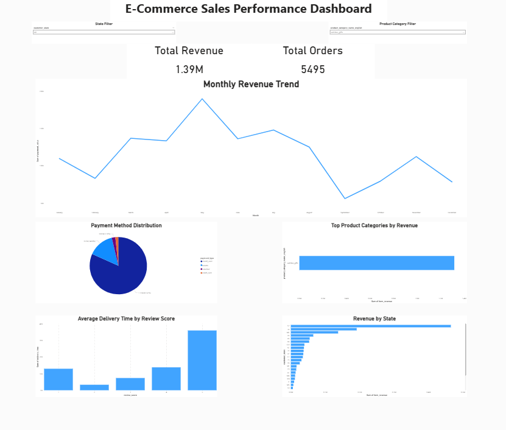

# 🛒 Olist E-Commerce Business Analysis

A data analysis project exploring sales performance, customer behavior, and operational insights using the Brazilian **Olist E-Commerce Dataset**.

---

## 📌 Project Overview

This project presents a comprehensive analysis of an e-commerce dataset from the Brazilian marketplace **Olist**.
The objective of this analysis is to explore customer behavior, sales patterns, product performance, and delivery efficiency in order to generate valuable business insights.

Through data cleaning, exploratory data analysis (EDA), and visualization, the project highlights key factors that influence sales performance and customer satisfaction.

---

## 📂 Dataset

The dataset used in this project is the **Brazilian E-Commerce Public Dataset by Olist**.

It contains information about:

* Customers
* Orders
* Products
* Payments
* Sellers
* Reviews
* Delivery times

The dataset allows analyzing the complete order lifecycle from purchase to delivery.

---

## 🛠️ Tools & Technologies

The following tools and technologies were used:

* Python
* Pandas
* NumPy
* Matplotlib
* Seaborn
* Jupyter Notebook
* Power BI (for dashboard visualization)

---

## 💡 Skills Demonstrated

* Data Cleaning
* Exploratory Data Analysis (EDA)
* Data Visualization
* Business Insight Generation
* Dashboard Design

---

## 🔎 Project Steps

### 1️⃣ Data Cleaning

* Handling missing values
* Removing duplicates
* Converting data types
* Preparing datasets for analysis

### 2️⃣ Exploratory Data Analysis (EDA)

* Sales distribution analysis
* Customer purchase behavior
* Product category performance
* Payment method analysis
* Delivery time analysis

### 3️⃣ Data Visualization

Different visualizations were created to understand patterns and trends such as:

* Sales trends
* Order distribution
* Top product categories
* Customer activity

### 4️⃣ Dashboard Creation

A business dashboard was created using **Power BI** to visualize key metrics including:

* Total sales
* Order distribution
* Product performance
* Customer insights

---

## 📊 Dashboard Preview



This dashboard was created using **Power BI** to visualize key business metrics from the Olist e-commerce dataset.
It highlights important insights such as sales distribution, product category performance, and customer purchasing behavior.

🔗 **View Full Interactive Dashboard:**  
[Open Power BI Dashboard](https://drive.google.com/file/d/1wW6lMGnYZq91qihRZiY9lpDU4iPal66D/view?usp=sharing)

---

## 📈 Key Insights

* Some product categories dominate total sales and revenue generation.
* Faster delivery times can significantly impact customer satisfaction.
* Certain payment methods are more frequently used by customers.
* Sales distribution varies across different product segments.

---

## 📚 Data Source

The dataset used in this project is publicly available on Kaggle.

🔗 [Olist Brazilian E-Commerce Dataset](https://www.kaggle.com/datasets/olistbr/brazilian-ecommerce)

---

## 📁 Repository Structure

```
Olist_Ecommerce_Business_Analysis.ipynb
dashboard.png
ecommerce_clean_dataset.rar
README.md
```

---

## 🚀 How to Run the Project

1. Download the dataset.
2. Open the Jupyter Notebook file.
3. Run the notebook cells sequentially to reproduce the analysis.

---

## 👩‍💻 Author

**Maryam Abusuaaifan**

Information Systems Graduate
Interested in Data Analysis, QA, and Backend Development.
